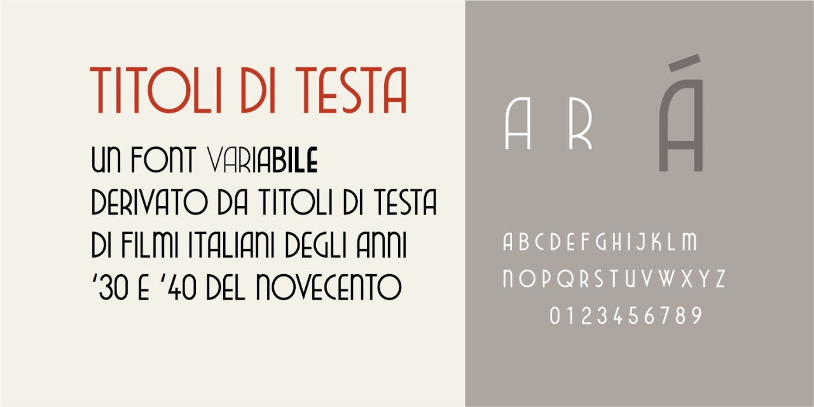
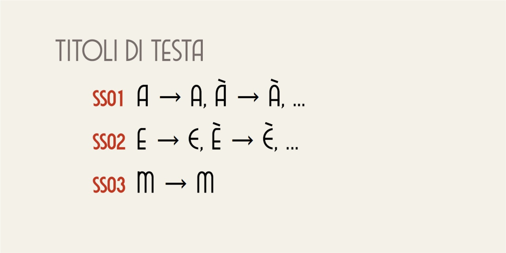

# Titoli Di Testa
- Versione 3.0: revisione generale.
- Versione 2.0: sistemazione generale dei caratteri.
- Versione 1.0: versione iniziale.

Per testare il font nella versione variabile, vedere la [pagina interattiva](https://m-casanova.github.io/titoliDiTesta/).

## Descrizione

**Titoli Di Testa** è un font variabile basato sui titoli di testa di vari film italiani degli anni '30 e '40 del Novecento.
Sono disponibili varianti per le lettere A, E, M.

